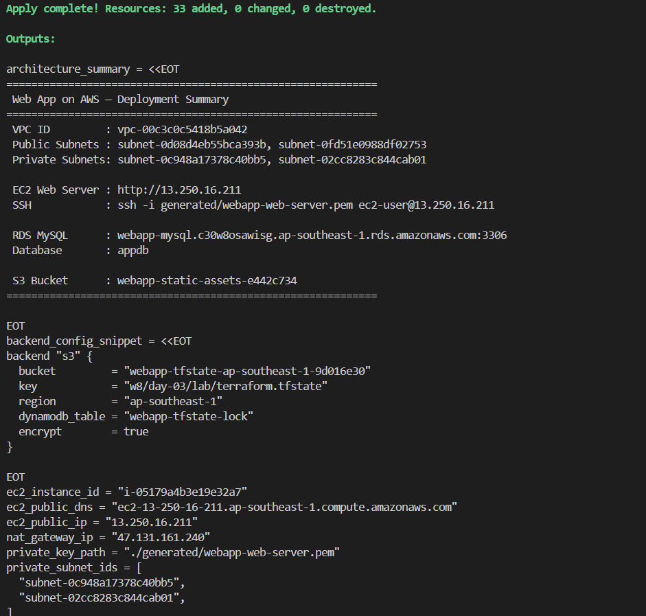

# 📸 Evidence — Final Project: Deploy a Web App on AWS

> **Week 8 · Day 3 Lab** | Họ tên: Phan Hoàng Nhật  
> **Ngày thực hiện**: 2026-06-08 | **Region**: ap-southeast-1 | **Account**: 312513453992

---

## Evidence 1 — Terraform Apply thành công

> Chụp terminal sau lệnh `terraform apply` — thấy số resources đã tạo và danh sách outputs (EC2 IP, RDS endpoint, S3 bucket)

<!-- BỎ SCREENSHOT VÀO ĐÂY -->

---

## Evidence 2 — EC2 (Public) + RDS (Private) đã tạo trên AWS

> **EC2**: Console → EC2 Instances → `webapp-web-server` đang **Running**, Subnet = public  
> **RDS**: Console → RDS Databases → `webapp-mysql` **Available**, **Publicly accessible: No**

<!-- BỎ SCREENSHOT EC2 VÀO ĐÂY -->

<!-- BỎ SCREENSHOT RDS VÀO ĐÂY -->

---

## Evidence 3 — S3 Backend State + RDS Security Group

> **S3 Backend**: S3 → `s3-terraform-remote-lab` → `w8/day-03/lab/terraform.tfstate` tồn tại  
> **Security Group**: RDS SG → Inbound rules → port 3306 chỉ từ EC2 Security Group (không phải 0.0.0.0/0)

<!-- BỎ SCREENSHOT S3 STATE VÀO ĐÂY -->

<!-- BỎ SCREENSHOT RDS SG VÀO ĐÂY -->

---

*W8 Day 3 Lab · PhanHoangNhat AWS Accelerator P2*
