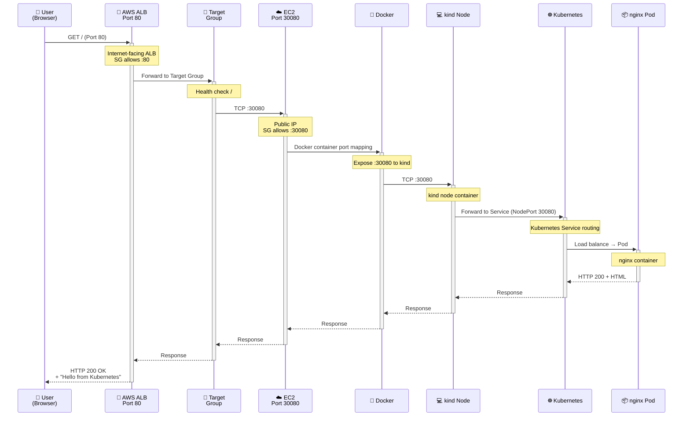
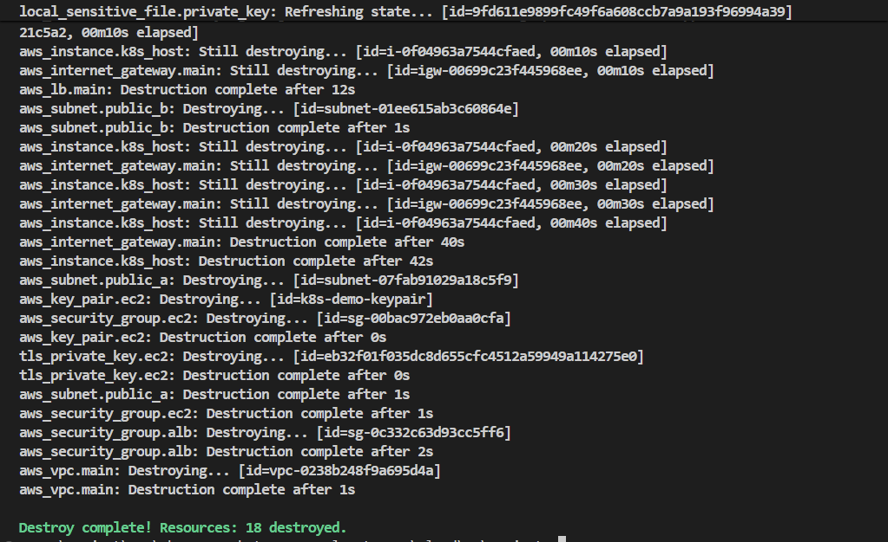

# Kubernetes on EC2 with ALB — Terraform Demo

Triển khai một **kind Kubernetes cluster** trong EC2 Ubuntu và expose ứng dụng nginx ra internet thông qua **Application Load Balancer (ALB)** — toàn bộ bằng Terraform.

---

## 📋 Mục lục

- [Lệnh chạy (Commands)](#lệnh-chạy-commands)
- [Kiến trúc (Architecture)](#kiến-trúc-architecture)
- [Cách Wire Provider (Provider Wiring)](#cách-wire-provider-provider-wiring)
- [Tuần tự hoạt động (Deployment Sequence)](#tuần-tự-hoạt-động-deployment-sequence)

---

## Lệnh chạy (Commands)

### 1. Chuẩn bị (Prerequisites)

```bash
# Cài đặt Terraform (>=1.5.0)
terraform version

# Cài đặt AWS CLI
aws --version

# Kiểm tra AWS credentials
aws sts get-caller-identity

# Cài đặt utilities (optional, nhưng hữu ích)
# - curl: download files
# - ssh-keygen: tạo SSH keys
# - grep/sed: text processing
```

### 2. Cấu hình biến môi trường (Setup Variables)

```bash
cd cloud/w8/project

# Copy file template variables
cp terraform.tfvars.example terraform.tfvars

# ⚠️ QUAN TRỌNG: Chỉnh sửa terraform.tfvars với các giá trị thực tế
# - aws_region: VD "ap-southeast-1" hoặc "us-east-1"
# - key_name: EC2 Key Pair name (phải tồn tại sẵn trong AWS)
# - private_key_path: Đường dẫn tới PEM file (VD: ~/.ssh/my-keypair.pem)
# - allowed_ssh_cidr: Địa chỉ IP của bạn dạng CIDR (VD: 203.0.113.42/32)
#
# Lấy IP hiện tại của bạn:
# Linux/macOS: curl -s ifconfig.me && echo "/32"
# Windows (PowerShell): Invoke-WebRequest -Uri "https://ifconfig.me" | Select-Object -ExpandProperty Content

nano terraform.tfvars  # hoặc dùng editor yêu thích
```

### 3. Khởi tạo Terraform (Initialize)

```bash
# Download providers và setup backend
terraform init

# Kiểm tra cấu hình là hợp lệ
terraform validate

# (Optional) Format code
terraform fmt -recursive
```

### 4. Lên kế hoạch (Plan)

```bash
# Xem những tài nguyên sẽ được tạo
terraform plan -out=tfplan

# Lưu plan thành file để review
# File tfplan có thể dùng để lần này apply
```

### 5. Triển khai (Apply)

```bash
# Cách 1: Apply từ file plan (an toàn nhất)
terraform apply tfplan

# Cách 2: Apply trực tiếp (sẽ hỏi confirm)
terraform apply

# ⏱️ Thời gian chờ: ~3-5 phút
# - EC2 launch + cloud-init: ~2 phút
# - Docker/kind/kubectl bootstrap: ~1 phút
# - Build Docker image + deploy: ~1 phút
```

### 6. Lấy thông tin Output (Get Outputs)

```bash
# Sau apply thành công, lấy ALB DNS name
terraform output alb_dns_name

# Lấy EC2 public IP (để SSH)
terraform output ec2_public_ip

# Lấy tất cả outputs
terraform output

# Lưu outputs vào file (nếu cần)
terraform output -json > outputs.json
```

### 7. Truy cập ứng dụng (Access Application)

```bash
# Chờ ~2 phút để EC2 bootstrap hoàn tất, rồi:
ALB_DNS=$(terraform output -raw alb_dns_name)

# Test qua curl
curl http://${ALB_DNS}

# Hoặc mở trong browser
# Kết quả: HTML page "Hello from Kubernetes on AWS"

# SSH vào EC2 (tùy chọn, để debug)
EC2_IP=$(terraform output -raw ec2_public_ip)
ssh -i ~/.ssh/my-ec2-keypair.pem ubuntu@${EC2_IP}

# Khi SSH vào EC2, check K8s status
# export KUBECONFIG=/home/ubuntu/.kube/config
# kubectl get all -n demo
# kubectl logs -n demo deployment/demo-app
```

### 8. Xem kết quả (View Outputs & Screenshots)

```bash
# Lấy tất cả terraform outputs
terraform output -json

# Output mẫu:
{
  "alb_dns_name": {
    "value": "http://k8s-demo-alb-1234567890.ap-southeast-1.elb.amazonaws.com"
  },
  "ec2_public_ip": {
    "value": "13.250.101.102"
  },
  "ec2_ssh_command": {
    "value": "ssh -i ~/.ssh/my-key.pem ubuntu@13.250.101.102"
  },
  "kubeconfig_path": {
    "value": "./generated/kubeconfig"
  },
  "node_port": {
    "value": 30080
  }
}

# Mở trong browser:
# ✅ http://k8s-demo-alb-1234567890.ap-southeast-1.elb.amazonaws.com
# 📄 Kết quả: HTML page "Hello from Kubernetes on AWS"
```

#### Screenshot từ Browser


#### Kiểm tra Application Logs

```bash
# SSH vào EC2
ssh -i ~/.ssh/my-key.pem ubuntu@$(terraform output -raw ec2_public_ip)

# Xem logs từ nginx pods
kubectl logs -n demo deployment/demo-app
# Output:
# 10.0.1.x - - [05/Jun/2026:10:30:45 +0000] "GET / HTTP/1.1" 200 156 ...
# 10.0.1.x - - [05/Jun/2026:10:30:46 +0000] "GET / HTTP/1.1" 200 156 ...

# Xem chi tiết pods
kubectl get pods -n demo -o wide
# NAME                        READY   STATUS    RESTARTS   IP           NODE
# demo-app-7d6f9c8b9-abc12    1/1     Running   0          10.244.0.2   demo-cluster-control-plane
# demo-app-7d6f9c8b9-def34    1/1     Running   0          10.244.0.3   demo-cluster-control-plane

# Xem services
kubectl get svc -n demo
# NAME          TYPE       CLUSTER-IP      EXTERNAL-IP   PORT(S)        AGE
# demo-app-svc  NodePort   10.96.123.45    <none>        80:30080/TCP   5m
```

### 9. Cleanup (Xóa hết tài nguyên)

```bash
# ⚠️ QUAN TRỌNG: Xóa tài nguyên để tránh phát sinh chi phí

# Cách 1: Xóa tất cả resources (khuyến nghị)
terraform destroy -auto-approve

# Cách 2: Xóa từng bước (interactive - sẽ hỏi confirm)
terraform destroy

# Cách 3: Xóa riêng một resource (nếu cần)
terraform destroy -target=aws_instance.k8s_host
terraform destroy -target=aws_lb.main

# Kiểm tra lại (không nên còn resources)
terraform state list  # Nên trống hoặc chỉ có local files

# Dọn dẹp thêm (local)
rm -rf generated/kubeconfig
rm -rf .terraform/
rm -f .terraform.lock.hcl
rm -f terraform.tfstate*
rm -f tfplan
```

#### Xác nhận Cleanup

```bash
# Sau destroy, kiểm tra AWS Console:
# 1. EC2 Instances: không còn instance
# 2. Load Balancers: không còn ALB
# 3. Security Groups: không còn sg-xxxxx
# 4. VPC: khi xóa hết → VPC trống hoặc chỉ có default resources

# Hoặc dùng AWS CLI:
aws ec2 describe-instances --query 'Reservations[].Instances[].InstanceId'
# Output: [] (rỗng = OK)

aws elbv2 describe-load-balancers --query 'LoadBalancers[].LoadBalancerArn'
# Output: [] (rỗng = OK)
```

### 9. Troubleshooting (Xử lý sự cố)

```bash
# Xem chi tiết logs khi deploy thất bại
terraform apply -var="debug=true"

# SSH vào EC2 để check user_data logs
ssh -i ~/.ssh/my-ec2-keypair.pem ubuntu@${EC2_IP}
tail -100 /var/log/user-data.log

# Check cloud-init status
cloud-init status
cloud-init query

# Check K8s cluster từ EC2
export KUBECONFIG=/home/ubuntu/.kube/config
kubectl cluster-info
kubectl get nodes
kubectl get pods -A

# Check Docker
docker ps
docker images

# Rebuild (nếu cần deploy lại app)
# Sửa app source (app/Dockerfile hoặc app/index.html)
# Rồi: terraform apply
# Terraform sẽ tự detect thay đổi + re-deploy app
```

---

## Kiến trúc (Architecture)

### 1. Sơ đồ toàn cảnh (Overall Diagram)

```
┌──────────────────────────────────────────────────────────────────────────┐
│                              AWS Account                                 │
│                                                                          │
│  ┌────────────────────────────────────────────────────────────────────┐ │
│  │                      VPC (10.0.0.0/16)                             │ │
│  │                                                                    │ │
│  │  ┌──────────────────┐                ┌──────────────────────────┐ │ │
│  │  │   IGW (IGW)      │                │  EC2 Instance (Ubuntu)   │ │ │
│  │  │                  │                │  Type: t3.medium         │ │ │
│  │  │  0.0.0.0/0       │                │  EBS: 30 GB gp3          │ │ │
│  │  └────────┬─────────┘                │                          │ │ │
│  │           │                          │  Subnet A (10.0.1.0/24)  │ │ │
│  │           │                          │  Public IP: *.*.*.* (ALB │ │ │
│  │           ▼                          │          forwards)        │ │ │
│  │  ┌─────────────────┐                │                          │ │ │
│  │  │ Public RTB      │                │  ┌────────────────────┐ │ │ │
│  │  │ 0.0.0.0/0→IGW   │                │  │  Docker Daemon     │ │ │ │
│  │  └────────┬────────┘                │  │  - Docker Engine   │ │ │ │
│  │           │                         │  │  - kind (K8s)      │ │ │ │
│  │           │                         │  │                    │ │ │ │
│  │        ┌──┴──┬──────┐               │  │  ┌──────────────┐  │ │ │
│  │        │ SA  │ SB   │               │  │  │ kind-control │  │ │ │
│  │        ▼     ▼      │               │  │  │ NodePort:    │  │ │ │
│  │  Subnet A  Subnet B │               │  │  │ 30080        │  │ │ │
│  │  (10.0.1.0/24)      │               │  │  │              │  │ │ │
│  │  az: a    (10.0.2.0/24)            │  │  │ Pods:        │  │ │ │
│  │          az: b                      │  │  │ ├─ nginx-1   │  │ │ │
│  │                                     │  │  │ └─ nginx-2   │  │ │ │
│  │  ┌─────────────────┐               │  │  └──────────────┘  │ │ │
│  │  │ ALB (internet)  │               │  └────────────────────┘ │ │ │
│  │  │ Port: 80        │───────────────┼──── Port: 30080         │ │ │
│  │  │ SG: alb-sg      │               │  (health check: /)      │ │ │
│  │  │ 2 AZs           │               │                          │ │ │
│  │  │                 │               │  SG: ec2-sg              │ │ │
│  │  │ ┌─────────────┐ │               │  - TCP 22 (SSH)         │ │ │
│  │  │ │ Target Grp  │ │               │  - TCP 30080 (NodePort) │ │ │
│  │  │ │ :30080      │ │               │  - TCP 443 (HTTPS SSH)  │ │ │
│  │  │ │ HTTP        │ │               │                          │ │ │
│  │  │ │ Health: ✓   │ │               └──────────────────────────┘ │ │
│  │  │ └─────────────┘ │               │                          │ │
│  │  └─────────────────┘               │ Subnet B (10.0.2.0/24)   │ │
│  │                                     │ (standby, for ALB ≥2 AZ) │ │
│  │                                     └──────────────────────────┘ │ │
│  └────────────────────────────────────────────────────────────────────┘ │
│                                                                          │
└──────────────────────────────────────────────────────────────────────────┘

                              Internet
                                 △
                                 │
                         User Browser
                        HTTP GET /
                            Port 80
```

### 2. Luồng Request (Request Flow)



### 3. Chi tiết kiến trúc từng tầng (Layered Architecture)

```
┌─────────────────────────────────────────────────────────────┐
│ Layer 1: AWS Infrastructure (Terraform)                     │
├─────────────────────────────────────────────────────────────┤
│ • VPC + Internet Gateway + Public Subnets                   │
│ • ALB + Target Group + Listener (Port 80)                  │
│ • EC2 Instance + Security Groups                            │
│ • IAM roles (nếu cần) + Key Pairs                           │
├─────────────────────────────────────────────────────────────┤
│ Layer 2: EC2 Host OS                                        │
├─────────────────────────────────────────────────────────────┤
│ • Ubuntu 22.04 LTS (user_data bootstrap)                   │
│ • Docker Engine                                             │
│ • kind (local Kubernetes)                                   │
│ • kubectl CLI                                               │
├─────────────────────────────────────────────────────────────┤
│ Layer 3: Kubernetes Cluster                                 │
├─────────────────────────────────────────────────────────────┤
│ • kind control-plane node (single node for demo)            │
│ • Namespace: demo                                            │
│ • Service (NodePort :30080)                                │
│ • Deployment (2 replicas)                                   │
├─────────────────────────────────────────────────────────────┤
│ Layer 4: Application                                        │
├─────────────────────────────────────────────────────────────┤
│ • Docker image: demo-app:latest (custom nginx)             │
│ • nginx Pod #1, #2 (on demo namespace)                     │
│ • Listens on :80 (inside pod)                              │
└─────────────────────────────────────────────────────────────┘
```

### 4. Network Zones (Vùng mạng)

```
┌────────────────────────────────────────────────────────────────┐
│ Public Internet (0.0.0.0/0)                                   │
│ [User Browser] ──(HTTP :80)──>                               │
└────────────────────────────────────────────────────────────────┘
                          │
                          ▼
┌────────────────────────────────────────────────────────────────┐
│ AWS Managed Zone (ALB)                                         │
│ • ALB: internet-facing = true                                 │
│ • SG alb-sg: Inbound 80/TCP from 0.0.0.0/0                   │
│ • Subnets: Subnet A + B (2 AZs)                              │
└────────────────────────────────────────────────────────────────┘
                          │
                          ▼ (port 30080)
┌────────────────────────────────────────────────────────────────┐
│ EC2 Private Zone (VPC Internal)                               │
│ • EC2 Instance (Subnet A, 10.0.1.0/24)                       │
│ • SG ec2-sg:                                                   │
│   - Inbound 30080/TCP from alb-sg                            │
│   - Inbound 22/TCP from allowed_ssh_cidr                     │
│ • Public IP (via IGW + route table)                          │
└────────────────────────────────────────────────────────────────┘
                          │
                          ▼
┌────────────────────────────────────────────────────────────────┐
│ Docker + Kubernetes (Isolated Network)                        │
│ • Docker bridge network (docker0)                             │
│ • kind pod network (172.18.0.0/16)                           │
│ • Kubernetes ClusterIP network (10.244.0.0/16)              │
│ • Service NodePort: 30080 → ClusterIP → Pod :80             │
└────────────────────────────────────────────────────────────────┘
```

---

## Cách Wire Provider (Provider Wiring)

### 1. Provider Dependencies (Đồ thị phụ thuộc)

```
Terraform Init Phase
      │
      ├─→ 1. AWS Provider (hashicorp/aws ~> 5.0)
      │       └─ Authenticates via AWS credentials
      │       └ Creates: VPC, ALB, EC2, Security Groups, etc.
      │
      ├─→ 2. TLS Provider (hashicorp/tls ~> 4.0)
      │       └─ Generates EC2 Key Pair (tls_private_key)
      │       └─ Creates SSH key for EC2 connection
      │
      ├─→ 3. Local Provider (hashicorp/local ~> 2.0)
      │       └─ Writes files locally (kubeconfig, etc.)
      │
      ├─→ 4. Null Provider (hashicorp/null ~> 3.0)
      │       └─ Remote-exec provisioners (SSH bootstrap)
      │
      └─→ 5. Kubernetes Provider (hashicorp/kubernetes ~> 2.0)
              └─ Optional (commented out in this setup)
              └─ Requires direct API access or SSH tunnel
```

### 2. Provider Configuration Details (Chi tiết cấu hình)

#### A. AWS Provider

```hcl
provider "aws" {
  region = var.aws_region  # ap-southeast-1

  default_tags {
    tags = {
      Project     = var.project_name      # k8s-demo
      ManagedBy   = "Terraform"
      Environment = "demo"
    }
  }
}
```

**Cách hoạt động:**

- Đọc AWS credentials từ:
  1. Environment variables: `AWS_ACCESS_KEY_ID`, `AWS_SECRET_ACCESS_KEY`
  2. `~/.aws/credentials` file
  3. IAM role (nếu chạy trên EC2)
  4. STS temporary credentials
- Tất cả resources được auto-tagged với default tags

#### B. TLS Provider

```hcl
resource "tls_private_key" "ec2" {
  algorithm = "RSA"
  rsa_bits  = 4096
}

resource "aws_key_pair" "ec2" {
  key_name       = var.key_name
  public_key_pem = tls_private_key.ec2.public_key_pem
}
```

**Cách hoạt động:**

- Tạo RSA keypair cục bộ
- Public key được gửi tới AWS (aws_key_pair)
- Private key được lưu trong Terraform state
- ⚠️ **Cảnh báo:** State file chứa private key → bảo vệ state!

#### C. Local Provider

```hcl
resource "local_file" "kubeconfig" {
  content  = templatefile(...)
  filename = "${path.module}/generated/kubeconfig"
}
```

**Cách hoạt động:**

- Ghi files vào local disk
- Dùng để lưu kubeconfig, scripts, logs
- `path.module` = thư mục hiện tại (where .tf files)

#### D. Null Provider (SSH Bootstrap Provisioner)

```hcl
resource "null_resource" "build_and_deploy" {
  triggers = {
    instance_id  = aws_instance.k8s_host.id
    app_hash     = sha256(...)
    manifest_hash = sha256(...)
  }

  connection {
    type        = "ssh"
    user        = "ubuntu"
    host        = aws_instance.k8s_host.public_ip
    private_key = tls_private_key.ec2.private_key_pem
    timeout     = "15m"
  }

  provisioner "remote-exec" { ... }
  provisioner "file" { ... }
}
```

**Cách hoạt động:**

- `connection` block: Kết nối SSH tới EC2
- `provisioner "remote-exec"`: Chạy commands qua SSH
- `provisioner "file"`: Upload files qua SFTP
- `triggers`: Re-run provisioner khi thay đổi

**Triggers logic:**

```
- instance_id thay đổi → rebuild+redeploy
- app_hash thay đổi (Dockerfile/index.html) → rebuild+redeploy
- manifest_hash thay đổi (K8s config) → redeploy
```

#### E. Kubernetes Provider (Reference only)

```hcl
# COMMENTED OUT because:
provider "kubernetes" {
  host                   = "https://127.0.0.1:6443"
  # Cannot reach because API server is internal to EC2

  # SOLUTION: Use SSH tunnel or remote-exec (our approach)
}

# Instead, we use:
provisioner "remote-exec" {
  inline = ["kubectl apply -f manifest.yaml", ...]
}
```

### 3. Provider Initialization Flow (Quy trình khởi tạo)

```
┌─── terraform init ──────────────────────────────────┐
│                                                     │
│ 1. Parse terraform{} block                         │
│    └─ required_providers, required_version        │
│                                                    │
│ 2. Download providers from Terraform Registry      │
│    ├─ aws     @ hashicorp/aws ~> 5.0              │
│    ├─ tls     @ hashicorp/tls ~> 4.0              │
│    ├─ local   @ hashicorp/local ~> 2.0            │
│    ├─ null    @ hashicorp/null ~> 3.0             │
│    └─ kubernetes @ hashicorp/kubernetes ~> 2.0    │
│                                                    │
│ 3. Create .terraform/plugins directory             │
│    └─ Store provider binaries                      │
│                                                    │
│ 4. Initialize backend (local backend by default)   │
│    └─ Create terraform.tfstate                     │
│                                                    │
│ 5. Create .terraform.lock.hcl                      │
│    └─ Pin versions for reproducible builds         │
│                                                    │
└────────────────────────────────────────────────────┘
```

### 4. Provider Authentication Chain (Chuỗi xác thực)

```
Terraform Apply
    │
    ├─→ AWS Provider Auth
    │   ├─ Env: AWS_ACCESS_KEY_ID
    │   ├─ Env: AWS_SECRET_ACCESS_KEY
    │   ├─ OR ~/.aws/credentials
    │   ├─ OR IAM role (on EC2)
    │   └─ Verify: sts:GetCallerIdentity
    │
    ├─→ TLS Provider (local compute)
    │   └─ No auth needed (local)
    │
    ├─→ Local Provider (filesystem)
    │   └─ No auth needed (local)
    │
    ├─→ AWS EC2 Created
    │   └─ (returns public_ip)
    │
    ├─→ Null Provider (SSH provisioner)
    │   ├─ Waits for EC2 to be reachable (retries)
    │   ├─ SSH auth: private_key (from tls_private_key)
    │   ├─ Connect: ubuntu@<EC2_public_ip>:22
    │   └─ Execute bootstrap scripts
    │
    └─→ All resources created ✓
```

---

## Tuần tự hoạt động (Deployment Sequence)

### Giai đoạn 1: Terraform Init & Plan (Local)

```
Step 1. terraform init
   ├─ Download providers
   ├─ Initialize state file
   └─ Create .terraform.lock.hcl

Step 2. terraform plan
   ├─ Parse all .tf files
   ├─ Evaluate variables from terraform.tfvars
   ├─ Create resource dependency graph
   ├─ Output plan (what will be created)
   └─ Save to tfplan (optional)

Duration: ~5-10 seconds
Dependencies: AWS credentials configured ✓
```

### Giai đoạn 2: AWS Infrastructure Creation (AWS API)

```
Step 3. terraform apply

   Parallel operations (Terraform DAG):
   ┌─────────────────────────────────────────────┐
   │ aws_vpc (create)                            │
   │  └─ Waits for: (none)                       │
   │  ├─ aws_internet_gateway (create)           │
   │  ├─ aws_subnet public_a (create)            │
   │  ├─ aws_subnet public_b (create)            │
   │  │  (Terraform runs 5-10 in parallel)       │
   │  └─ aws_route_table (create)                │
   │     └─ aws_route_table_association_a        │
   │     └─ aws_route_table_association_b        │
   │                                              │
   │ (in parallel)                                │
   │ tls_private_key (generate locally)          │
   │  └─ aws_key_pair (register with AWS)        │
   │                                              │
   │ (waits for: VPC, subnets, security groups)  │
   │ aws_security_group alb_sg (create)          │
   │ aws_security_group ec2_sg (create)          │
   │  │                                           │
   │  ├─ aws_lb (create)                         │
   │  │  └─ Depends on: subnets                  │
   │  │  └─ Waits for: security groups           │
   │  │                                           │
   │  ├─ aws_lb_target_group (create)            │
   │  │  └─ Depends on: vpc                      │
   │  │  └─ Health check configured              │
   │  │                                           │
   │  ├─ aws_lb_listener (create)                │
   │  │  └─ Depends on: ALB, target group        │
   │  │                                           │
   │  └─ aws_instance k8s_host (create + launch)│
   │     └─ Depends on: VPC, subnet, SG, key    │
   │     └─ Runs user_data script                │
   │                                              │
   └─────────────────────────────────────────────┘

Duration: ~2 minutes (EC2 launch + user_data bootstrap)
```

### Giai đoạn 3: EC2 Bootstrap (user_data script)

```
Step 4. EC2 Instance launched
   └─ user_data script executes (automatically)

   [On EC2 — templates/user_data.sh.tpl]

   a) Update system packages
      └─ apt-get update && apt-get upgrade -y
      └─ Duration: ~30-45 seconds

   b) Install Docker
      └─ curl -fsSL https://get.docker.com | sh
      └─ usermod -aG docker ubuntu
      └─ systemctl start docker
      └─ Duration: ~30-45 seconds

   c) Install kubectl
      └─ Download and install kubectl binary
      └─ Move to /usr/local/bin/kubectl
      └─ Duration: ~10-15 seconds

   d) Install kind
      └─ Download and install kind binary
      └─ Move to /usr/local/bin/kind
      └─ Duration: ~5-10 seconds

   e) Create Kubernetes cluster (kind)
      └─ kind create cluster --name demo \
           --config <(cat <<EOF
         kind: Cluster
         apiVersion: kind.x-k8s.io/v1alpha4
         nodes:
         - role: control-plane
           extraPortMappings:
           - containerPort: 30080
             hostPort: 30080
             protocol: TCP
         EOF
         )
      └─ Duration: ~1-2 minutes (pull images, bootstrap)
      └─ Result: kind-control-plane container running
      └─ kubeconfig saved to ~/.kube/config

   f) Verify cluster
      └─ kubectl cluster-info
      └─ kubectl get nodes
      └─ Duration: ~5-10 seconds

   Total duration: ~3-5 minutes

   Status indicator: cloud-init-output.log
   └─ Check via: tail -f /var/log/cloud-init-output.log
```

### Giai đoạn 4: Terraform Provisioning (SSH)

```
Step 5. null_resource "build_and_deploy" triggered
   (Terraform waits for EC2 to be healthy)

   a) SSH connection check
      ├─ Terraform tries: ssh -i key ubuntu@<EC2_IP>:22
      ├─ Retry logic: 5 minute timeout
      ├─ Waits for EC2 userdata to complete
      └─ Duration: ~1-2 minutes (including retries)

   b) cloud-init status check (remote-exec)
      └─ ubuntu$ cloud-init status --wait
      └─ Blocks until user_data fully complete
      └─ Duration: ~30 seconds

   c) Wait for kubectl ready
      └─ ubuntu$ kubectl get nodes
      └─ Waits for all nodes to be Ready
      └─ Duration: ~30 seconds

   d) Build app directory
      └─ ubuntu$ mkdir -p /tmp/app-build
      └─ Duration: instant

   e) Upload app source files (file provisioner)
      ├─ Upload app/Dockerfile → /tmp/app-build/Dockerfile
      ├─ Upload app/index.html → /tmp/app-build/index.html
      └─ Duration: ~5-10 seconds (SFTP upload)

   f) Build Docker image on EC2
      └─ ubuntu$ docker build -t demo-app:latest /tmp/app-build/
      └─ Dockerfile steps:
         ├─ FROM nginx:1.27
         ├─ COPY index.html /usr/share/nginx/html/
         └─ EXPOSE 80
      └─ Duration: ~30-45 seconds (nginx image pull + build)

   g) Load image into kind cluster
      └─ ubuntu$ kind load docker-image demo-app:latest --name demo
      └─ Imports image from Docker daemon into kind nodes
      └─ Duration: ~10-20 seconds

   h) Upload K8s manifests (file provisioner)
      └─ Generate from templates/k8s-manifests.yaml.tpl
      └─ Upload → /tmp/k8s-manifests.yaml
      └─ Duration: ~5 seconds

      Content: Namespace, ConfigMap, Deployment, Service
      └─ namespace: demo
      └─ deployment: demo-app (2 replicas)
      └─ service: NodePort 30080 → Pod :80

   i) Deploy to Kubernetes (remote-exec)
      └─ ubuntu$ kubectl apply -f /tmp/k8s-manifests.yaml
      └─ Creates:
         ├─ Namespace demo
         ├─ ConfigMap (project metadata)
         ├─ Deployment demo-app (pulls demo-app:latest)
         └─ Service NodePort (30080)
      └─ Duration: ~20-30 seconds

   j) Wait for rollout
      └─ ubuntu$ kubectl rollout status deployment/demo-app -n demo
      └─ Waits for 2 replicas to be Ready
      └─ Duration: ~45-60 seconds
      └─ Checks: Pods running, containers healthy, probes pass

   k) Verify deployment
      └─ ubuntu$ kubectl get all -n demo
      └─ Output: Deployment, ReplicaSet, Pods, Service
      └─ Duration: ~5 seconds

   Total provisioning time: ~5-7 minutes
```

### Giai đoạn 5: ALB Target Attachment (AWS API)

```
Step 6. aws_lb_target_group_attachment (create)
   (only after bootstrap.tf null_resource completes)

   └─ Register EC2 instance with ALB target group
      ├─ Instance: aws_instance.k8s_host
      ├─ Target Group: aws_lb_target_group.app (port 30080)
      ├─ Health check: GET / (expects 200 OK)
      └─ Duration: ~2-5 minutes

      Health check flow:
      ├─ ALB sends: GET http://<EC2_IP>:30080/
      ├─ EC2:30080 → kind:30080 (Docker port mapping)
      ├─ kind:30080 → Service NodePort (K8s routing)
      ├─ Service → nginx Pod (load balanced)
      ├─ nginx responds: 200 OK
      └─ ALB marks: Healthy ✓

      Once healthy (state=InService):
      ├─ ALB starts forwarding traffic
      └─ Application is live!

Duration: ~2-5 minutes (health check polling)
```

### Giai đoạn 6: Application Live (User Access)

```
Step 7. terraform output & access application

   curl http://<ALB_DNS_NAME>/

   Request path:
   ├─ Browser → ALB:80 (internet facing)
   ├─ ALB → Target Group:30080
   ├─ TG → EC2 public IP:30080
   ├─ EC2 Docker → kind container:30080
   ├─ kind → K8s Service NodePort:30080
   ├─ Service → Deployment (load balance 2 replicas)
   ├─ Deployment → nginx Pod:80
   ├─ nginx responds: HTML (Hello from Kubernetes on AWS)
   └─ Browser: ✓ Displays page

Duration: ~100-200ms per request

Key outputs:
├─ terraform output alb_dns_name
│  └─ Example: k8s-demo-alb-1234567890.ap-southeast-1.elb.amazonaws.com
├─ terraform output ec2_public_ip
│  └─ Example: 52.123.45.67
└─ All resources tagged with Project=k8s-demo
```

### Full Deployment Timeline (Timeline toàn bộ)

```
Total Duration: ~15-20 minutes (first run)
Breakdown:

0:00-0:05   terraform init (download providers)
0:05-0:10   terraform plan
0:10-0:15   terraform apply (VPC, ALB, EC2 creation)
            └─ EC2 launch starts

0:15-2:30   EC2 bootstrap (user_data)
            ├─ System setup: 1:00
            ├─ Docker + kubectl + kind: 1:30
            └─ kind cluster creation: 3:00-5:00

2:30-3:30   Terraform provisioner (SSH boot wait)
            └─ Retry loop, waiting for EC2 ready

3:30-8:30   Terraform provisioner (build & deploy)
            ├─ Docker build: 1:00-1:30
            ├─ kind load image: 0:30
            ├─ K8s deploy + rollout: 2:00-3:00
            └─ Total: ~5 minutes

8:30-13:30  ALB target health check
            └─ Polling until Healthy (2-5 minutes)

13:30+      🎉 Application LIVE
            └─ curl/browser access working!

---

For subsequent deployments (app changes only):
├─ terraform apply (detects app file hash change)
├─ Skips EC2 recreation
├─ Only rebuilds Docker image + redeploys K8s
├─ Duration: ~3-5 minutes (faster than first run)
```

---

## Troubleshooting Reference (Tham khảo xử lý sự cố)

| Issue                              | Diagnosis                                | Solution                                     |
| ---------------------------------- | ---------------------------------------- | -------------------------------------------- |
| `terraform init` fails             | Terraform not installed or wrong version | `terraform version >= 1.5.0`                 |
| `terraform apply` fails (AWS auth) | AWS credentials not configured           | `aws sts get-caller-identity`                |
| EC2 instance not accessible        | SG or SSH key issue                      | Check `allowed_ssh_cidr`, verify key exists  |
| user_data script fails             | Check EC2 logs                           | SSH then: `tail -100 /var/log/user-data.log` |
| Kind cluster not created           | Docker not ready                         | SSH then: `docker ps`, `kind get clusters`   |
| K8s pods not running               | Manifest or image issue                  | SSH then: `kubectl describe pod -n demo`     |
| ALB shows unhealthy target         | Health check failing                     | Check: `curl localhost:30080` from EC2       |
| Application returns 503/504        | Pod not ready or crashed                 | `kubectl logs -n demo deployment/demo-app`   |

nginx Pod :80 (replicas=2, round-robin)

````

---

## Sơ đồ Mermaid

```mermaid
graph TD
    User["🌐 User Browser"] -->|HTTP:80| ALB["AWS ALB\n(internet-facing)"]
    ALB -->|HTTP:30080| TG["Target Group"]
    TG -->|port 30080| EC2["EC2 Ubuntu\n(t3.medium)"]
    EC2 -->|kind extraPortMappings| KindNode["kind Node Container"]
    KindNode --> SVC["K8s Service\nNodePort 30080"]
    SVC -->|ClusterIP| Pod1["nginx Pod 1\n(port 80)"]
    SVC -->|ClusterIP| Pod2["nginx Pod 2\n(port 80)"]

    subgraph "Security"
        ALB_SG["ALB-SG\n0.0.0.0/0:80"] --> ALB
        EC2_SG["EC2-SG\nALB-SG → :30080\nSSH CIDR → :22"] --> EC2
    end
````

---

## Vai trò từng Provider

### 1. AWS Provider (`hashicorp/aws ~> 5.0`)

Tạo toàn bộ hạ tầng AWS:

| Resource                             | File          | Mô tả                                        |
| ------------------------------------ | ------------- | -------------------------------------------- |
| `data.aws_vpc.default`               | `network.tf`  | Sử dụng Default VPC                          |
| `data.aws_subnets.public`            | `network.tf`  | Public subnets từ Default VPC                |
| `aws_security_group.alb`             | `security.tf` | SG cho ALB: inbound 80 từ internet           |
| `aws_security_group.ec2`             | `security.tf` | SG cho EC2: SSH từ CIDR, 30080 từ ALB SG     |
| `aws_instance.k8s_host`              | `ec2.tf`      | EC2 Ubuntu 22.04 LTS với user_data bootstrap |
| `aws_lb.main`                        | `alb.tf`      | Application Load Balancer                    |
| `aws_lb_target_group.app`            | `alb.tf`      | Target Group port 30080                      |
| `aws_lb_listener.http`               | `alb.tf`      | HTTP Listener port 80                        |
| `aws_lb_target_group_attachment.app` | `alb.tf`      | Attach EC2 vào TG                            |

### 2. Local Provider (`hashicorp/local ~> 2.0`)

Lưu files generated vào local disk:

- `generated/kubeconfig` — Kubeconfig copy từ EC2, dùng cho debug local

### 3. Null Provider (`hashicorp/null ~> 3.0`)

Orchestrate quá trình bootstrap qua SSH remote-exec:

| Resource                         | Mô tả                                              |
| -------------------------------- | -------------------------------------------------- |
| `null_resource.wait_bootstrap`   | Poll `/var/tmp/k8s-ready` mỗi 15s (tối đa 30 phút) |
| `null_resource.fetch_kubeconfig` | Copy kubeconfig từ EC2 về `generated/`             |
| `null_resource.deploy_k8s`       | Chạy `kubectl apply` trực tiếp trong EC2           |

### 4. Kubernetes Provider (`hashicorp/kubernetes ~> 2.0`)

> ⚠️ **Limitation**: API server của kind cluster chạy trên `127.0.0.1` bên trong EC2, không accessible từ bên ngoài. Kubernetes Provider cần kết nối TCP trực tiếp đến API server, điều này không khả thi mà không có SSH tunnel.

**Chiến lược fallback**: Tất cả K8s resources (Namespace, ConfigMap, Deployment, Service) được deploy thông qua `null_resource.deploy_k8s` dùng `remote-exec` chạy `kubectl apply` bên trong EC2.

File `kubernetes.tf` chứa tất cả resources ở dạng comment để tham khảo cấu trúc. Nếu muốn dùng Kubernetes Provider trực tiếp, xem phần [SSH Tunnel](#ssh-tunnel-advanced) bên dưới.

---

## Cấu trúc thư mục

```
.
├── providers.tf          # AWS, Null, Local, Kubernetes providers
├── variables.tf          # Input variables với validation
├── outputs.tf            # alb_dns_name, ec2_public_ip, node_port, etc.
├── network.tf            # Default VPC + public subnets data sources
├── security.tf           # Security Groups: ALB và EC2
├── ec2.tf                # EC2 Ubuntu + Ubuntu AMI data source
├── alb.tf                # ALB, Target Group, Listener, TG Attachment
├── bootstrap.tf          # Null provider: wait → kubeconfig → deploy K8s
├── kubernetes.tf         # K8s resources (reference/commented, fallback via remote-exec)
├── templates/
│   └── user_data.sh.tpl  # Bootstrap: Docker + kubectl + kind + cluster
├── generated/
│   ├── .gitkeep          # Placeholder (gitignore actual generated files)
│   └── kubeconfig        # (generated) Kubeconfig fetched từ EC2
└── README.md
```

---

## Biến cần cấu hình

Tạo file `terraform.tfvars` trong thư mục này:

```hcl
# terraform.tfvars — KHÔNG commit file này
aws_region       = "ap-southeast-1"
project_name     = "k8s-demo"
instance_type    = "t3.medium"       # Minimum: 2 vCPU / 4GB RAM
key_name         = "my-ec2-keypair"  # Tên Key Pair đã tạo trong AWS Console
private_key_path = "~/.ssh/my-ec2-keypair.pem"  # Đường dẫn tuyệt đối
allowed_ssh_cidr = "203.0.113.42/32" # IP của bạn, lấy từ: curl ifconfig.me
node_port        = 30080
cluster_name     = "demo-cluster"
```

### Bảng biến đầy đủ

| Biến               | Bắt buộc | Default          | Mô tả                                 |
| ------------------ | -------- | ---------------- | ------------------------------------- |
| `aws_region`       | ❌       | `ap-southeast-1` | AWS Region                            |
| `project_name`     | ❌       | `k8s-demo`       | Prefix cho tên resources              |
| `instance_type`    | ❌       | `t3.medium`      | EC2 type (min 2vCPU/4GB)              |
| `key_name`         | ✅       | —                | Tên EC2 Key Pair trong AWS            |
| `private_key_path` | ✅       | —                | Path tới file PEM private key         |
| `allowed_ssh_cidr` | ✅       | —                | CIDR được phép SSH (vd: `1.2.3.4/32`) |
| `node_port`        | ❌       | `30080`          | K8s NodePort (30000-32767)            |
| `cluster_name`     | ❌       | `demo-cluster`   | Tên kind cluster                      |

---

## Cách chạy

### Prerequisites

```bash
# Cài đặt cần thiết
terraform --version   # >= 1.5.0
aws --version         # AWS CLI configured
ssh-keygen --version  # SSH client

# Configure AWS credentials (một trong các cách sau)
aws configure
# hoặc
export AWS_ACCESS_KEY_ID="..."
export AWS_SECRET_ACCESS_KEY="..."
export AWS_DEFAULT_REGION="ap-southeast-1"

# Lấy IP hiện tại của bạn để dùng làm allowed_ssh_cidr
curl -s ifconfig.me && echo "/32"
```

### Khởi tạo và Deploy

```bash
# 1. Clone repo và vào thư mục
cd cloud/w8/day-03

# 2. Tạo terraform.tfvars (xem mẫu ở trên)
cp terraform.tfvars.example terraform.tfvars  # nếu có
# hoặc tạo mới với các giá trị của bạn

# 3. Initialize Terraform
terraform init

# 4. Preview changes (khuyến nghị)
terraform plan

# 5. Deploy toàn bộ (~10-15 phút, chủ yếu chờ EC2 bootstrap)
terraform apply -auto-approve
```

Sau khi `apply` thành công, bạn sẽ thấy output:


Mở `alb_dns_name` trong browser để xem nginx demo app.

> ⏱️ **Lưu ý**: ALB health check mất 1-2 phút để mark target là healthy sau khi pods ready.

### Destroy

```bash
# Xóa toàn bộ resources
terraform destroy -auto-approve
```



## Debug & Troubleshooting

### SSH vào EC2

```bash
# Lấy IP từ output
EC2_IP=$(terraform output -raw ec2_public_ip)
ssh -i ~/.ssh/my-key.pem ubuntu@$EC2_IP
```

### Kiểm tra trạng thái Kubernetes

```bash
# Sau khi SSH vào EC2
kubectl get nodes
kubectl get pods -n demo
kubectl get svc -n demo
kubectl describe pod -n demo  # nếu pod có vấn đề
```

Expected output:

```
NAME                 STATUS   ROLES           AGE
demo-cluster-control-plane   Ready    control-plane   5m

NAME                        READY   STATUS    RESTARTS
demo-app-7d6f9c8b9-abc12    1/1     Running   0
demo-app-7d6f9c8b9-def34    1/1     Running   0

NAME           TYPE       CLUSTER-IP      PORT(S)        AGE
demo-app-svc   NodePort   10.96.xxx.xxx   80:30080/TCP   4m
```

### Xem logs bootstrap

```bash
# Cloud-init logs (toàn bộ bootstrap process)
sudo cat /var/log/user-data.log

# Hoặc theo dõi real-time khi đang chờ
sudo tail -f /var/log/user-data.log

# Kiểm tra sentinel file
cat /var/tmp/k8s-ready

# kind cluster status
kind get clusters
kind get nodes --name demo-cluster
```

### Test NodePort trực tiếp từ EC2

```bash
# Thử curl trực tiếp vào NodePort (bỏ qua ALB)
curl -v http://localhost:30080
```

### Kiểm tra ALB health

```bash
# Từ local machine (sau khi terraform apply)
ALB_DNS=$(terraform output -raw alb_dns_name | sed 's|http://||')
curl -v http://$ALB_DNS
```

### Xem kubeconfig local

```bash
# Kubeconfig được fetch về local sau bootstrap
cat generated/kubeconfig
# LƯU Ý: Server URL trong file này là 127.0.0.1 bên trong EC2
# Không thể dùng trực tiếp từ local mà không có SSH tunnel
```

---

## SSH Tunnel (Advanced)

Nếu muốn dùng Kubernetes Provider Terraform hoặc `kubectl` từ máy local:

```bash
# 1. Lấy API server port từ kubeconfig
API_PORT=$(grep 'server:' generated/kubeconfig | grep -oP ':\K[0-9]+')

# 2. Mở SSH tunnel (chạy background)
ssh -N -L ${API_PORT}:localhost:${API_PORT} \
    -i ~/.ssh/my-key.pem \
    ubuntu@$(terraform output -raw ec2_public_ip) &

# 3. Sửa kubeconfig để dùng local tunnel
export KUBECONFIG=./generated/kubeconfig
# Thay server URL thành localhost
kubectl get nodes  # Bây giờ hoạt động từ local

# 4. Uncomment Kubernetes resources trong kubernetes.tf
# Và enable provider với config_path = "${path.module}/generated/kubeconfig"
```

---

## Security Considerations

| Rule                                  | Lý do                                           |
| ------------------------------------- | ----------------------------------------------- |
| NodePort 30080 KHÔNG mở ra internet   | Chỉ ALB SG mới được phép → EC2:30080            |
| SSH chỉ từ `allowed_ssh_cidr`         | Không bao giờ dùng `0.0.0.0/0` cho SSH          |
| Private key KHÔNG commit vào git      | Chỉ `key_name` (tên) được ghi vào tfvars        |
| AWS credentials KHÔNG trong code      | Dùng `aws configure` hoặc environment variables |
| `terraform.tfvars` trong `.gitignore` | Chứa thông tin nhạy cảm                         |
